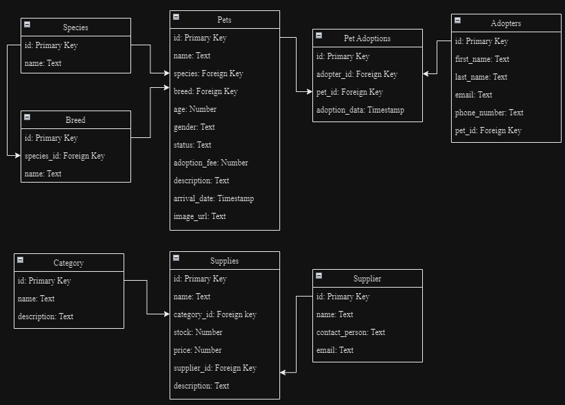

# SnuggleStop
 A full-stack web application designed to streamline pet adoption and supply designed for inventory management. 

## Table of Contents
- [Installation](#installation)
- [Diagrams](#diagrams)
- [Features](#features)
- [Tech Stack](#tech-stack)
- [Project Structure](#project-structure)
- [Screenshots](#Screenshots)
- [License](#license)

## Installation
1. **Clone the repository:**
    ```bash
    git clone []
    cd SnuggleStop
    ```
2. **Install dependencies:**
    ```bash
    npm i
    ```
3. **Start the server:**
    ```bash
    npm start
    ```
4. **Access the application:**
Open your browser and go to http://localhost:8080.

## Disagram
Diagram of the database for SnuggleStop


## Features

## Tech Stack
- Postgres
- Tailwind CSS
- Typescript
- React.js
- Express.js
- Node.js

## Project Structure

## Screenshots


## License
Distributed under the MIT License. See `LICENSE` for more information.